Peter Leconte r0830684 3AD

# Report Cross Development - Qt

## Intro

```
 ___________________________
< Cross development with Qt >
 ---------------------------
        \   ^__^
         \  (oo)\_______
            (__)\       )\/\
                ||----w |
                ||     ||
```

For our first report we will be developing our test case in Qt in C++.  
We will then cross-compile our Qt application from Linux to Windows.

For this we'll be using MXE to cross-compile the code from our project on Linux
(in a Docker container) for Windows.

### Test case

The test case I chose was Cowsay4k. An application to generate a 4k image of a 
cow with a speech bubble. Inspired by the cli tool `cowsay`.

The test case had to contain the following:

- [X] Standard widgets like buttons/text fields/comboboxes/....
    - Input field for text
    - Buttons to generate, go back, open the color picker and export
- [X] Self made widget that needs to be drawn with primitives
    - Custom widget for drawing a scaled version of the generated image
    - Custom widget for showing the selected color (+ contrasted text color)
- [X] A dialog for selecting a file or a color
    - Color picker for text color and speech bubble
    - Dialog for selecting where the exported image will be saved
- [X] File I/O or Settings storage.
    - Writes the image when exporting
- [X] The window has a variable content (like in Qt a QStackedWidget)
    - First page includes what will be generated
    - Second page shows the result and option to export it

Some extra's the project contains:

- Networking to grab a random qoute online as a starting point for the input field
- Randomly picks an image each time you generate

## Steps followed

### Setting up docker

I've decided to run the cross-compiler in a Docker container.  
This has plenty of advantages. This makes our image portable, meaning we can run 
it on any platform including Windows and Linux and since it runs in a container 
we don't have to worry about dependency issues with our host.  
The container can also leverage full system resources such as RAM from our host which would be 
limited on a virtual machine.

For this we'll first create a Dockerfile which we will then use to generate a Docker image.

The first step for our Dockerfile is to choose the starting image. I wanted to pick the base Alpine
image first because of the smaller image size but this is prone to having
compiling issues due to Lib C compatiblity with musl (a C library).  
Thus I chose to take an Ubuntu image.

```dockerfile
FROM ubuntu:22.04 as compiler
```

For the remainder of the Dockerfile I followed the https://mxe.cc/#tutorial as 
a guideline.

The next step was to automatically install all the requirements for mxe from: 
https://mxe.cc/#requirements-debian. Ubuntu is a derivative from Debian.  
Since we don't want it to be interactive in a Docker we will add `-y`.

```dockerfile
# https://mxe.cc/#requirements-debian
RUN apt-get update && apt-get install -y \
    autoconf \
    automake \
    autopoint \
    bash \
    bison \
    bzip2 \
    flex \
    g++ \
    g++-multilib \
    gettext \
    git \
    gperf \
    intltool \
    libc6-dev-i386 \
    libgdk-pixbuf2.0-dev \
    libltdl-dev \
    libssl-dev \
    libtool-bin \
    libxml-parser-perl \
    lzip \
    make \
    openssl \
    p7zip-full \
    patch \
    perl \
    python3 \
    python3-mako \
    ruby \
    sed \
    unzip \
    wget \
    xz-utils
```

Even though python3 is installed with the requirements, it is not properly used  
during the install since `python` gets called and not `python3`.  
I solved this by creating a symbolic link.
Similar issue/solution: https://github.com/mxe/mxe/issues/2860

```dockerfile
# Fix python not found with symlink
RUN ln -s /usr/bin/python3 /usr/bin/python
```

After this we can start building MXE from source.

For this we first need to clone from their Github repository. I did this with a 
depth of 1 to minimize the size of the image.
I cloned this in the /opt/mxe directory as suggested by the mxe tutorial.

```dockerfile
# Build MXE from source
RUN git clone --depth 1 https://github.com/mxe/mxe.git /opt/mxe

WORKDIR /opt/mxe

ARG jobs=12
```

Here I also specified the work directory to /opt/mxe and set the jobs to 12 in a variable.
The working directory will simply spare me multiple cd commands and the jobs
variable is used later on inside the Dockerfile inside the make commands.

These jobs will specify the number of CPU's threads utilised, which defaults to 6.  
My CPU has 16 threads so I decided to increase the number of jobs to 12.  
See https://mxe.cc/#usage for more info.

The next few RUN statements were split up as much as possible.  
In Docker RUN statements get cached during build, as long as they don't change
and the statements beforehand don't change either.

This way if a RUN statement fails, I can adjust that RUN statement and keep the
cache of the previous ones.

After cloning I prepared the downloads with make so that the necessary packages
have been downloaded before the build.
This is mostly done for caching reasons as clarified above.

```dockerfile
# Cache download
RUN make download-cmake download-qtbase --jobs=$jobs 
```

Second step was `make cmake`. Since I use CMake (not QMake) for my project.

```dockerfile
# Build
RUN make cmake --jobs=$jobs MXE_TARGETS="x86_64-w64-mingw32.static x86_64-w64-mingw32.shared"
```

I've decided to add 2 targets (toolchains):
- `x86_64-w64-mingw32.static`: Static for Windows 64 bit, x86_64 arch toolchain
- `x86_64-w64-mingw32.shared`: Shared for Windows 64 bit, x86_64 arch toolchain

I will be using static since this is more convenient (just one executable).  
However, I also targeted shared for experimenting and just in case I would
need it (for use with an installer for example).
You can add as many or little targets as you want here.

In the third step we build the Qt base package. This contains everything I need
to build my project with. In some cases you might still need other packages 
such as multimedia if you for example use sound.  
However for my project qtbase is sufficient.

```dockerfile
RUN make qtbase --jobs=$jobs MXE_TARGETS="x86_64-w64-mingw32.static x86_64-w64-mingw32.shared"
```

After compiling the build tools I can clear out the junk files.
This includes unused files such as package files, temporary files and logs.
This is done to minimize the docker image size.

```dockerfile
# Clean out junk
RUN cd /opt/mxe && \
    make clean-junk && \
    rm -rf "/opt/mxe/pkg/*"
```

The last step is to set the environment path to include MXE binaries.

```dockerfile
# Set environment variables to use MXE binaries
ENV PATH="/opt/mxe/usr/bin:${PATH}"
```

The complete Dockerfile looks as follows:

```dockerfile
FROM ubuntu:22.04 as compiler

# https://mxe.cc/#requirements-debian
RUN apt-get update && apt-get install -y \
    autoconf \
    automake \
    autopoint \
    bash \
    bison \
    bzip2 \
    flex \
    g++ \
    g++-multilib \
    gettext \
    git \
    gperf \
    intltool \
    libc6-dev-i386 \
    libgdk-pixbuf2.0-dev \
    libltdl-dev \
    libssl-dev \
    libtool-bin \
    libxml-parser-perl \
    lzip \
    make \
    openssl \
    p7zip-full \
    patch \
    perl \
    python3 \
    python3-mako \
    ruby \
    sed \
    unzip \
    wget \
    xz-utils

# Fix python not found with symlink
RUN ln -s /usr/bin/python3 /usr/bin/python

# Build MXE from source
RUN git clone --depth 1 https://github.com/mxe/mxe.git /opt/mxe

WORKDIR /opt/mxe

ARG jobs=12

# Cache download
RUN make download-cmake download-qtbase --jobs=$jobs 
    
# Build
RUN make cmake --jobs=$jobs MXE_TARGETS="x86_64-w64-mingw32.static x86_64-w64-mingw32.shared"
RUN make qtbase --jobs=$jobs MXE_TARGETS="x86_64-w64-mingw32.static x86_64-w64-mingw32.shared"

# Clean out junk
RUN cd /opt/mxe && \
    make clean-junk && \
    rm -rf "/opt/mxe/pkg/*"

# Set environment variables to use MXE binaries
ENV PATH="/opt/mxe/usr/bin:${PATH}"
```

### Building the image with Docker and creating a container

We can create our Docker image from our Dockerfile with
`docker build . -t mxe:latest`.

After compiling MXE (for the millionth time because of small mistakes :D),
we can start up a docker container with `docker run -it -v $(pwd):/app mxe:latest`.

This will run an interactive container and mount the source files from our
current working directory in /app.  
You can also add `--rm` if you want the container to be removed after use.

Now we can continue from our shell to build our project.

### Building the project

After entering the container we can start building our project.  

1. Change directory to /app with `cd /app`
    1. This directory is mounted to the host, any files created here will be
    accessible on the host
2. We can now use `x86_64-w64-mingw32.static-cmake ./build` since I used CMake
for my project.
    1. This will generate a configured Makefile for us.
3. Change directory to `./build` with `cd build`
4. We can start building our project with `make`.

With CMake with could do an out-of-tree build however we want to stay inside our
mounted /app here so we can access the files from our host.

After the last step we can find the following files inside our build folder:

```bash
❯ ls
CMakeFiles
Cowsay4k_autogen
cmake_install.cmake
CMakeCache.txt
Cowsay4k.exe
Makefile
```

Our `Cowsay4k.exe` file is now ready to be used on a Windows machine.

### Testing the executable

There are multiple ways to test out our fresh out of the oven executable.  
I decided to run this with Wine. This ran effortlessly and worked as expected.

1. Text can be entered/altered
    1. A random qoute is taken online on startup
2. Color dialog pops up and a color can be picked
    1. The custom color widget displays the taken color and picks a contrasting
    text color
3. Image gets generated and scales as expected in the window
    1. A random cow image is picked for the generation
    2. The text bubble is drawn and goes towards the correct location on the picture
    3. Text is drawn and new lines make the text bubble larger
4. Image can be exported
    1. Default directories (if available) were loaded properly
    2. There are no problems with path selection and naming the file

## Changes in concept because of the technology used

No changes were made to the original concept.

## Links to theory lesson

### Make and CMake

MXE uses `make` as their build system. For my own project I also used CMake 
which generates a make file which I can build the project with.

#### Out-of-tree build

With CMake it is easy to do an out-of-tree build by specifying the build folder
in the CMake command. This will build the project in a folder outside of the 
source code folder.

### Cross build

We used a cross build, not a native build. Which means we use a toolchain on our
workstation (Linux) for a different target (Windows).

### Toolchain

To cross-compile we use a different toolchain to target Windows. In this case 
the MinGW-w64 runtime and compiler was used on a Linux workstation.

### Cross-compilation toolchain components

#### Binutils

The binutils can be found in `/opt/mxe/usr/bin`.
This is also the path that we added to our Dockerfile path environment.  

These binaries start with their respective target as a prefix.

#### Compilers

Binutils also where you can find **compilers** such as g++.

#### Kernel headers

Kernel headers can be found in `./usr/x86_64-w64-mingw32.static/include/`
where `x86_64-w64-mingw32.static` is our target.

#### C library

- Since we are compiling for Windows we are using CRT or Universal C runtime for
Windows.  
`/opt/mxe# find . | grep .*crt.*\.a` tells us this resides in: 
`usr/x86_64-w64-mingw32.static/lib/`
- Alpine uses musl which is an implementation of the standard C library

### Executables

`File <our executable>` will tell us if it's for Windows or Linux
- PE32+ is for Windows
- ELF is for Linux

```bash
# Compiled application on linux for windows using MXE
❯ file Cowsay4k.exe
Cowsay4k.exe: PE32+ executable (GUI) x86-64, for MS Windows

# Compared to ...

# Compiled application, native toolchain on Linux
❯ file Cowsay4k
Cowsay4k: ELF 64-bit LSB pie executable, x86-64, version 1 (GNU/Linux), dynamically linked, interpreter /lib64/ld-linux-x86-64.so.2, BuildID[sha1]=fa10b3f0834dabb8d7d90ab402fdd22f0f7429c6, for GNU/Linux 4.4.0, with debug_info, not stripped
```

## Screenshot of end result

### Wine (running windows executable)

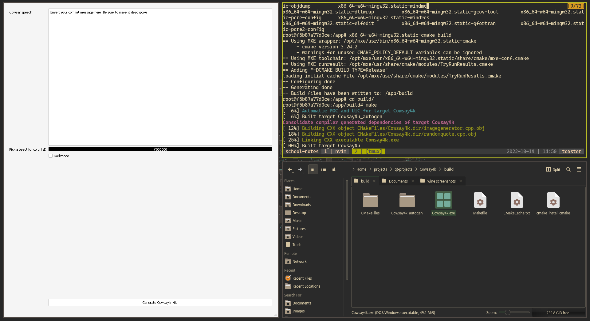  
Building in docker with the output in the build folder, application opened with wine.

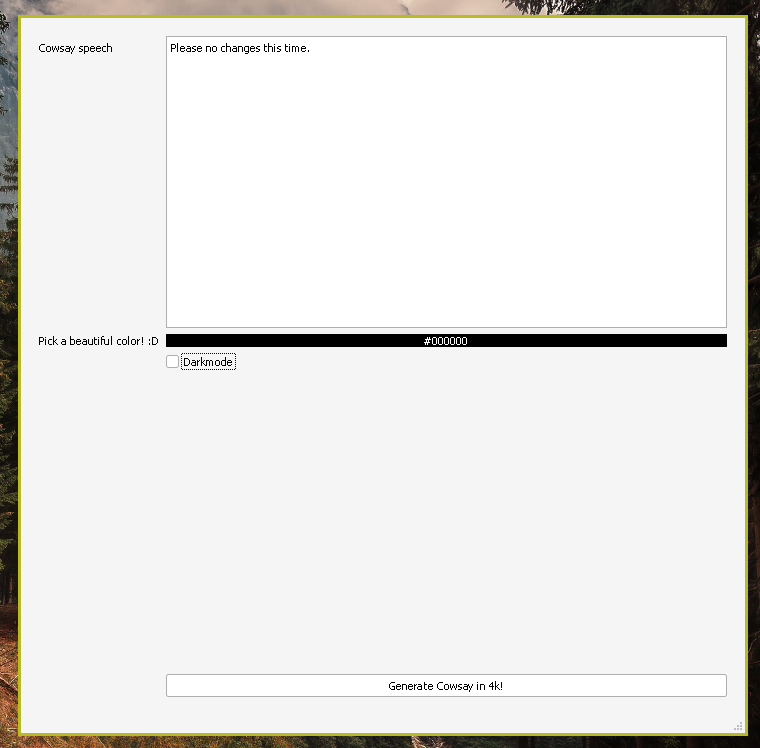  
A fresh start up of the app with wine. Random quote with networking working.

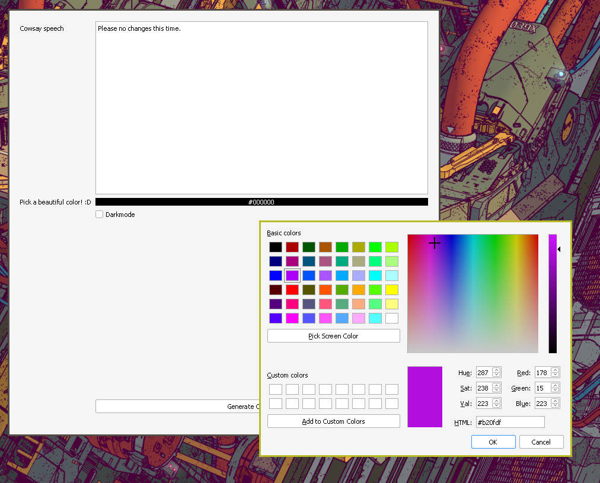  
Color picker dialog opens as expected.

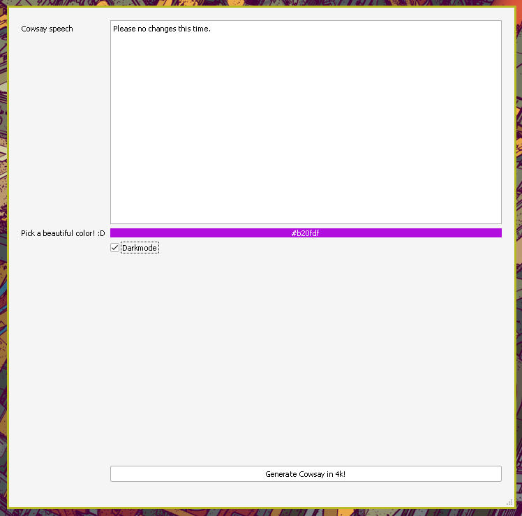  
Color picker works as expected.

  
Generating with random picture works.

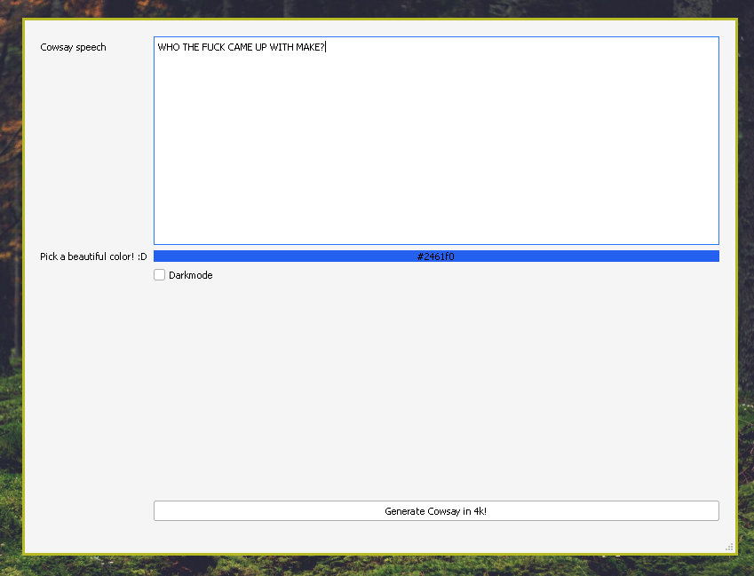  
Another random quote with networking, different color.

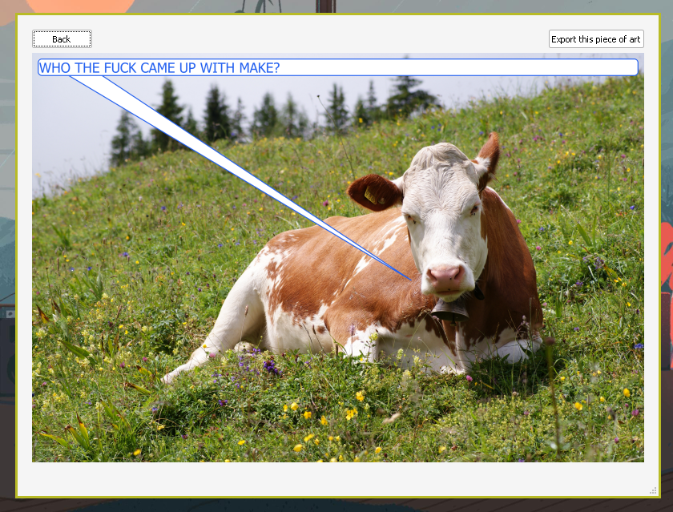  
Different random cow picture.

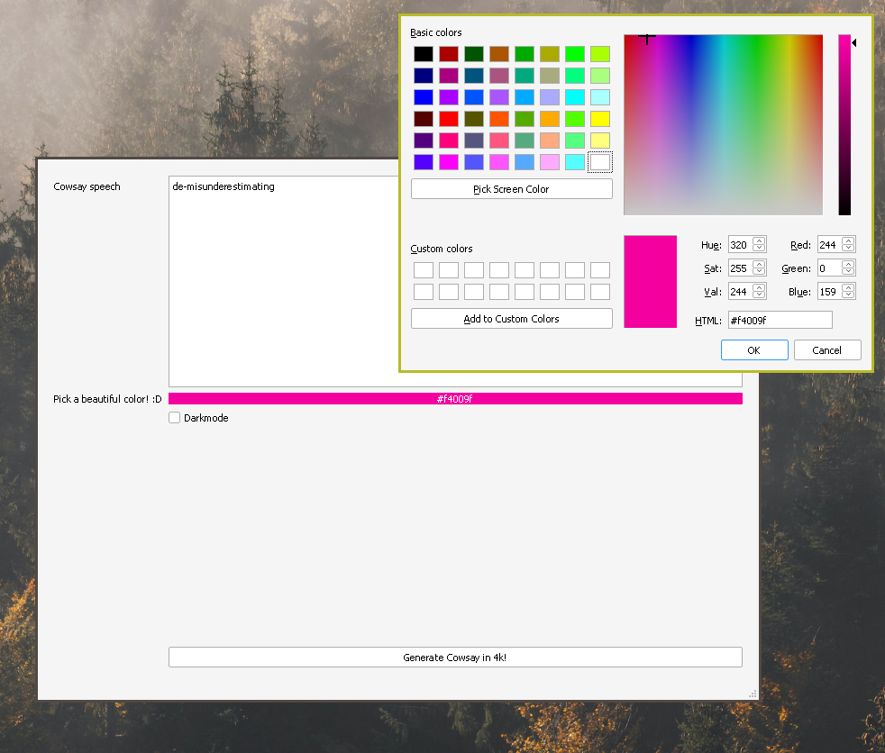  
The color dialog but pink!

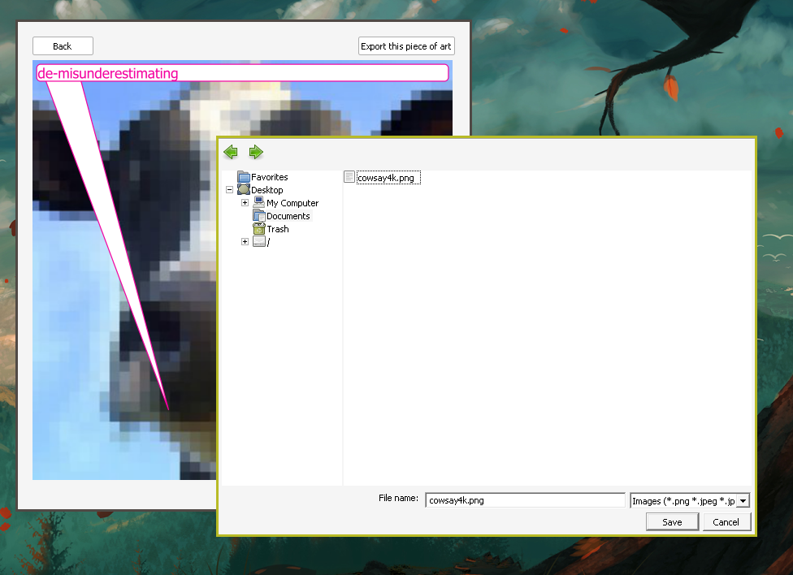  
Exporting the image with wine works as expected.

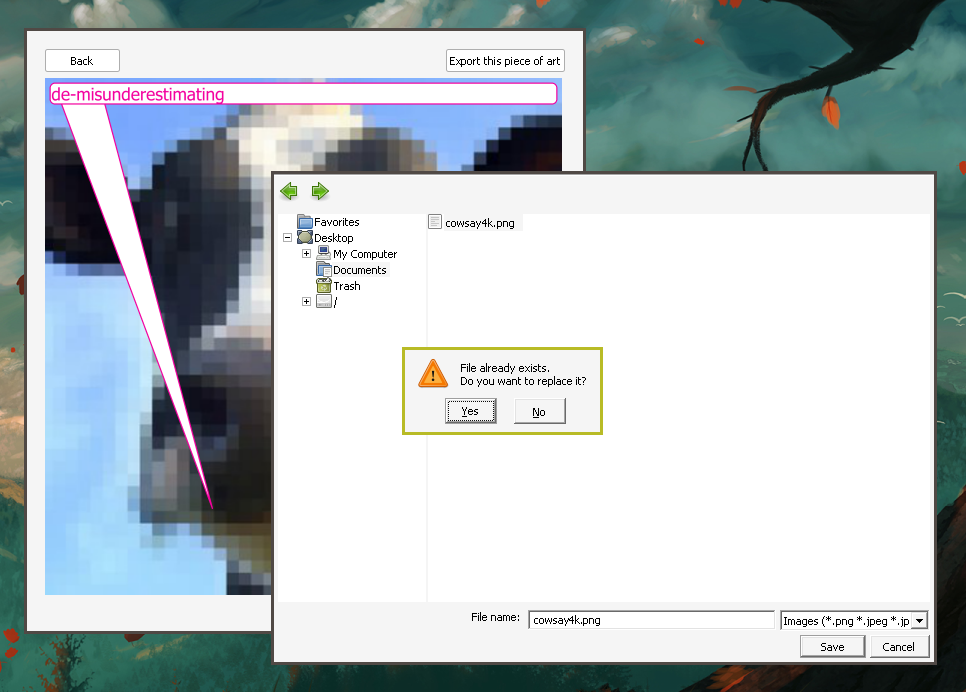  
Overwriting a file works.

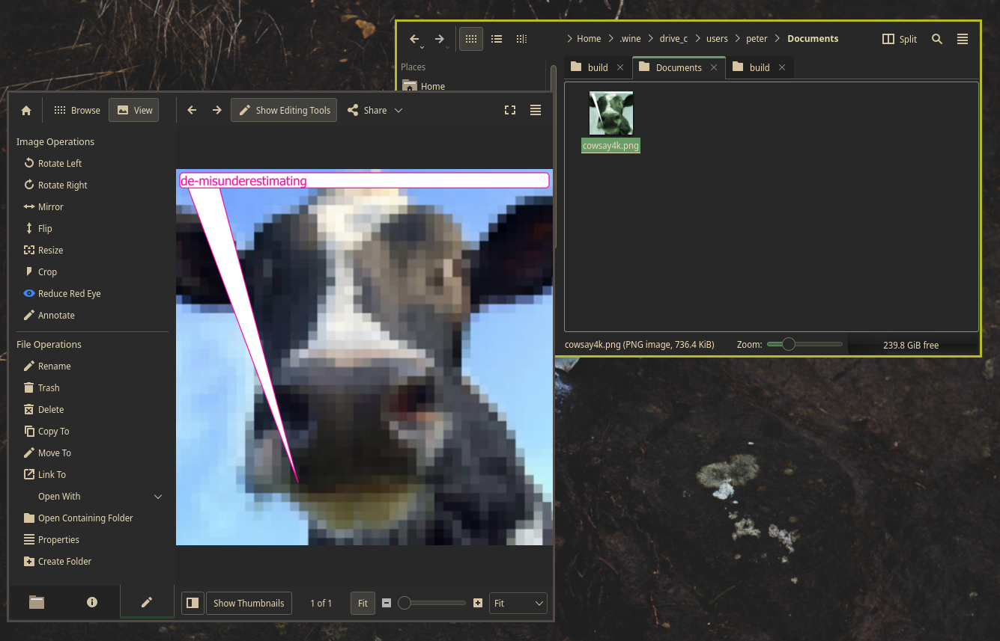  
The image is in the C drive of Wine and we can properly open it in Linux.

### Linux version

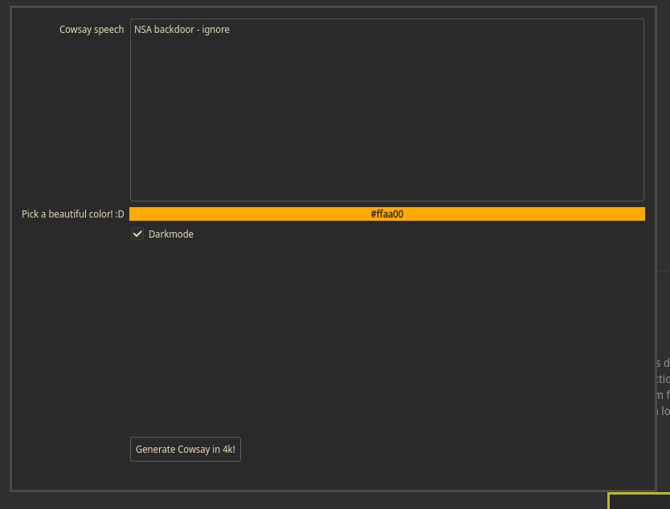  
Start screen of the application, with a random qoute and picked color

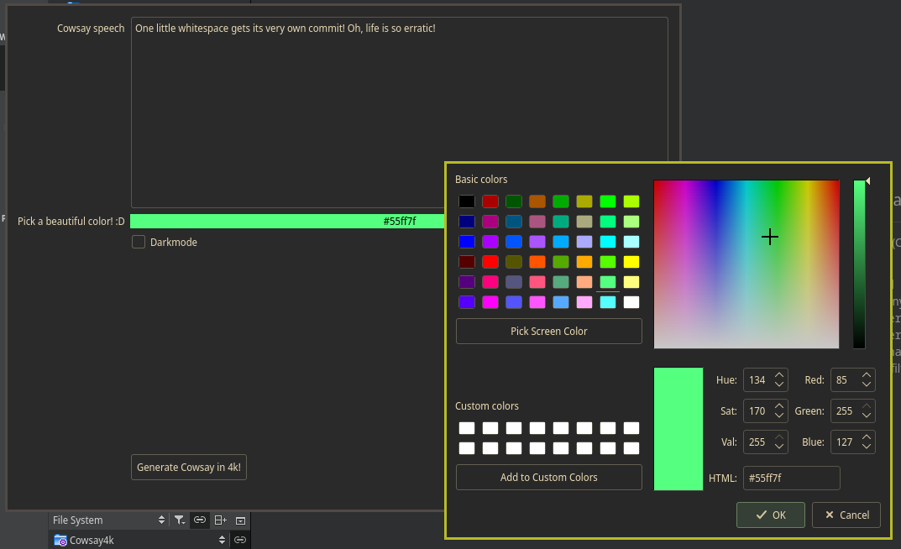  
Color picker with another qoute.

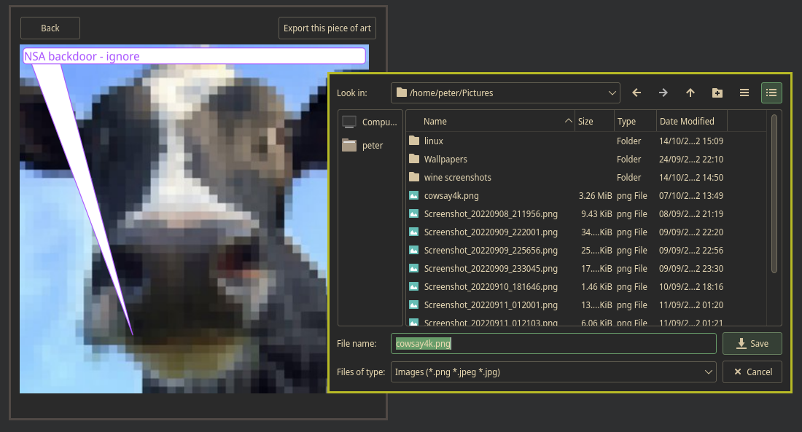  
Working file export.

## Conclusion

MXE provides a good cross compilation environment where we can easily choose
our toolchain targets and build our application from a linux host.  
Together with Docker we can easily create an image with MXE used for cross compilation 
on many platforms.

It was fun to optimize the Dockerfile for a smaller image size and get MXE working with it.

With these two combined we were able to cross-compile a Windows executable of our Qt 
application.

## Extra's 

- I decided to use Docker.  
This seemed preferable to me over a VM, even if the initial effort might be higher
compared to a VM.  
With docker I don't have to limit system resources (such as RAM) and I can also 
use this image on multiple platforms such as Linux and Windows. 
I also wouldn't have to install the needed dependencies on my host machine.
- I used Wine to run the executable on Linux for testing.
- I used networking in my project and tested this on both platforms.

